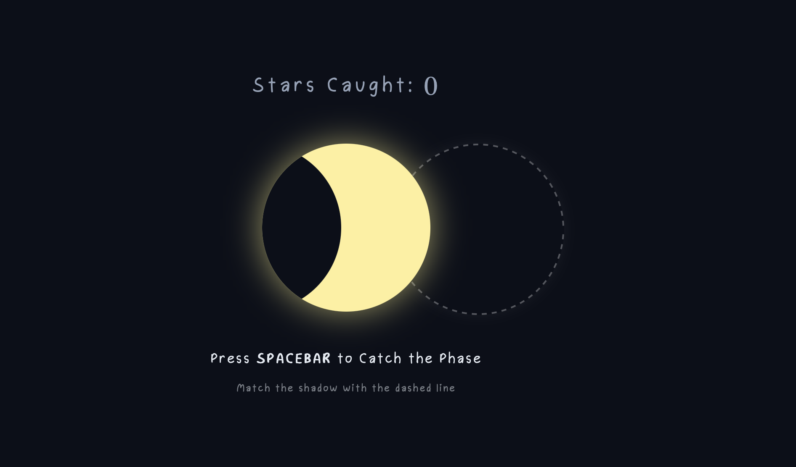

# Phase Match

A one-key web game where you match shifting lunar phases to align the sky. 

  

## About 
This game is a simple reaction-time web game focused on visual alignment and timing. It provides a focused challenge where players track moving cycles and test their rhythm, offering a fun task from daily screen work.

For future updates, I would love to create a mobile version that uses screen taps instead of the spacebar so you can play it anywhere.

## Try It 
Demo: https://pia-png.github.io/phase-match/

## Features
* One key control - spacebar
* Catching a phase creates a starburst 
* Every successful match creates a star in your nigth sky
* A soft, cozy aesthetic with smooth CSS transitions 

## Built With
* HTML
* CSS
* JavaScript 
